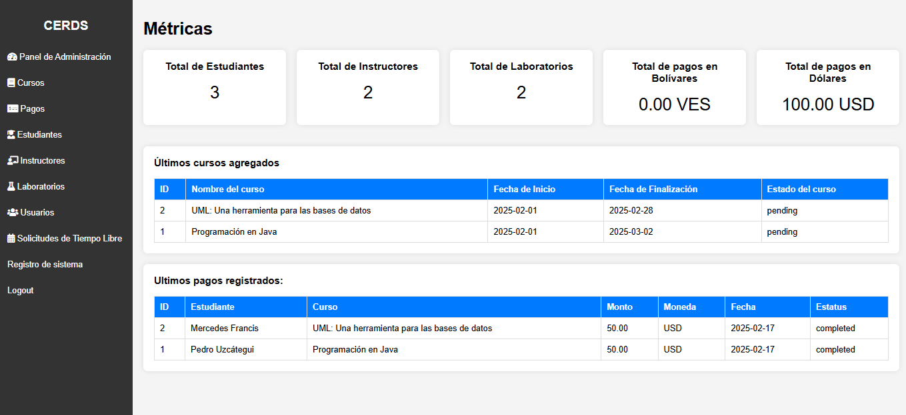
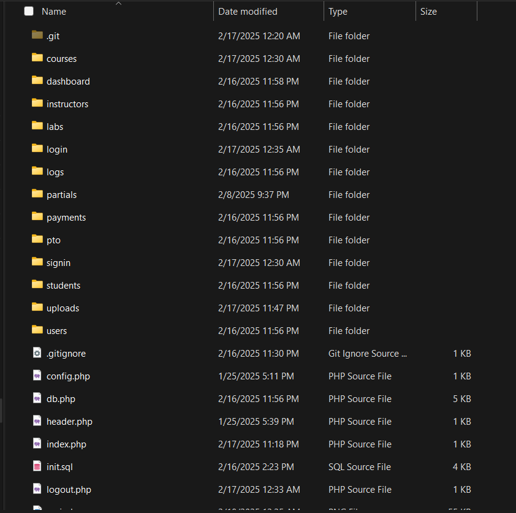
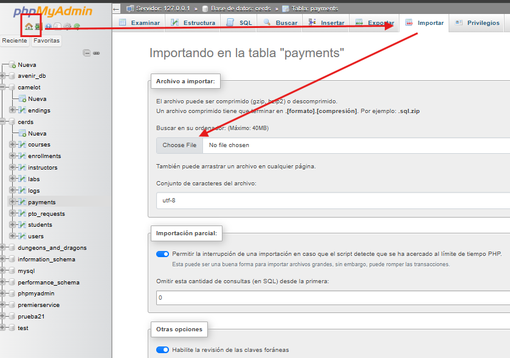

# Sistema de administración de cursos CERDS

El sistema de administración de cursos CERDS es un sistema fácil de usar, con el cual se puede realizar las operaciones de registro de cursos, instructores, pagos, y mucho más.

# Instalación

1. Para instalar el proyecto, descarga el zip.

2. Luego, debes extrar el .zip en tu disco duro, en la carpeta htdocs de tu servidor. Es recomendado usar XAMPP: `<TU_DISCO_DURO>/xampp/htdocs/sistema-cursos`

3. Asegurate que el contenido de la carpeta `sistema-cursos`, sea el siguiente:
   

4. Luego, toma el archivo `cerds.sql`, e importalo en `localhost/phpmyadmin` (si deseas un archivo SOLO para crear la base de datos vacia, puedes usar `init.sql`, pero los datos de prueba SOLO estan si importas `cerds.sql`.)

5. Luego, visita `localhost/sistema-cursos/` (si no te llegase a cargar, puedes visitar `localhost/sistema-cursos/signin`)

## Credenciales de prueba

- Usuario #1
  -- User: test
  -- Password: test

- Usuario #2
  -- User: admintest
  -- Password: test

- Usuario #3
  -- User: alexismola
  -- Password: test

### Características del Sistema

- Panel de Administración
- Cursos
- Instructores
- Laboratorios
- Logs
- Pagos
- Solicitudes de Tiempo Libre
- Usuarios
